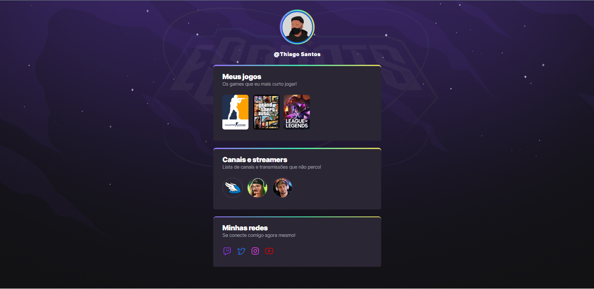

# Nlw eSports 



> Trilha Explorer

[](https://travis-ci.org/joemccann/dillinger)

> Project built from Rocketseat's Next Level Week event

:link: <a href="https://thiagosgomes-dev.github.io/nlw-eSports/" target="_blank" >Click here to see the project.<a/>

## :wrench: tech

- :white_check_mark: [HTML 5] - Semantics is handled by best practices.
- :white_check_mark: [CSS 3] - Written with class that conveys structural and fundamental meaning.
- :white_check_mark: [markdown-it] - Markdown done correctly. fast and easy.

## Development

Want to contribute? Great!

The fundamental parts are as follows:

Fork the project & local clone.
Create a remote upstream and sync with your local copy before branching.
Make a branch for each separate piece of work.
Make the changes, write nice commit messages, and read the CONTRIBUTING file when it exists.
Push to your home right.
Create in new PR (Pull Request) on GitHub.

Verify the deployment by navigating to your server address in
your preferred browser.

```sh
https://thiagosgomes-dev.github.io/nlw-eSports/
```

## :incoming_envelope: Contact

thiagodos.10@gmail.com

## License

MIT

**Free Software!**

:beginner::beginner::beginner:
